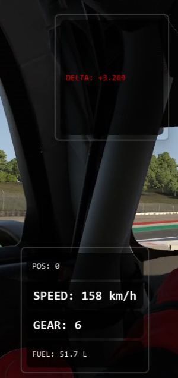
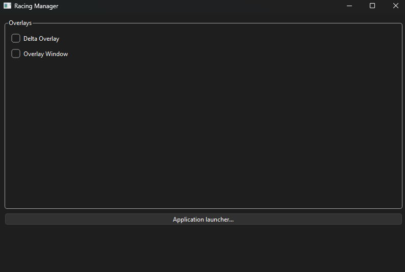
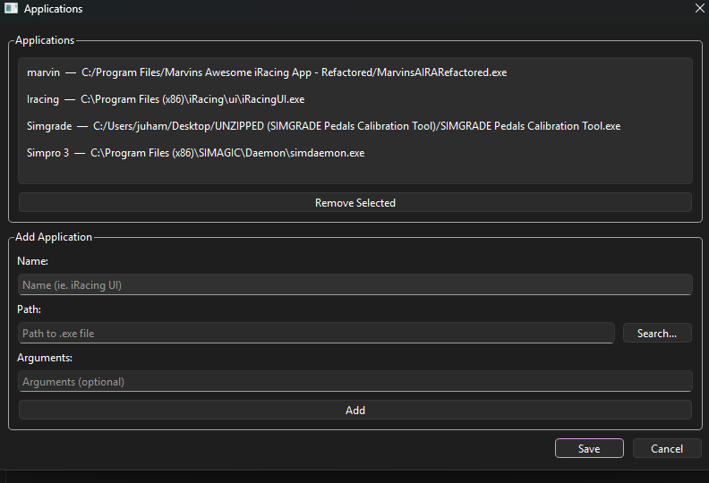

# RacingManager

This is my C++/Qt learning process where I'm going to learn how to code force feedback features and general SDK development with C++. The UI is built with Qt.
The idea of this project is to be my "one-for-all" tool where I can adjust my racing wheel's FFB and other settings, and also launch other applications I use when playing iRacing. Overlays also play a huge role.

## Features
I have implemented a simple UI where user can select desired Overlays and make application launch options. Purpose of this "Application Launcher" is to open all the necessary
applications which are used when driving IRacing.

I have also implemented a simple delta-overlay, and position-speed-gear-fuel-overlay.

Stack:
C++20
Qt 6

And of course I use LLM's to pair program/study. LLM's which are mainly used are Claude, and Github Copilot.